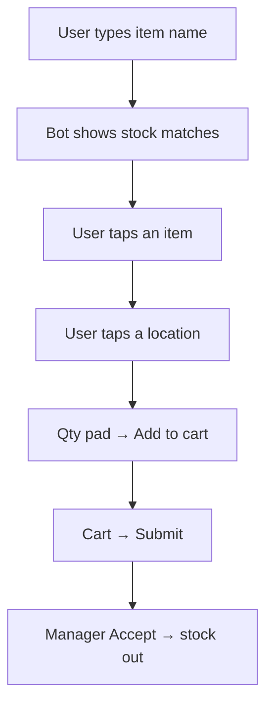
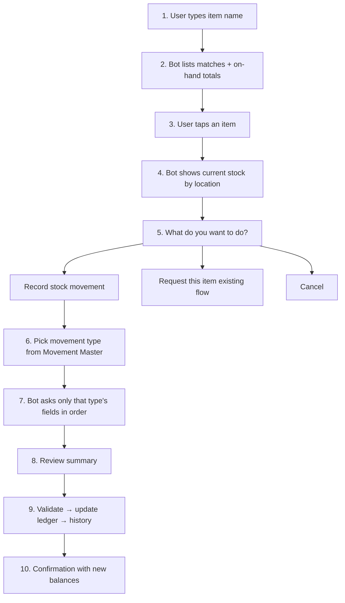

# Search-group stock movement workflow (Telegram messages only)

## Decision locked in

- **No `/move` (or any slash) to start.** Users type an item name, same as today’s search group.
- Stock movements are driven by **bot messages + inline buttons**.
- This plan is the **conversation design only**. Implementation (permissions, session storage, Movement Master field config, approvals) comes after you confirm this flow.

## What the search group does today

Telegram groups in **request** mode already work like this ([`lib/request-engine.ts`](lib/request-engine.ts)):

Plain text = search. Everything else is buttons. We keep that rule.

## Proposed stock-movement workflow

Same entry: **type the item name**. After the user picks an item, show **current stock**, then ask what they want to do — including stock movements — via buttons.

### Step-by-step (what the user sees)

**1–3. Search & select (unchanged feel)**  
- User: `USB-C cable`  
- Bot: matches with totals → user taps one item.

**4. Stock details**  
- Bot shows product name/number and each location with qty.  
- Buttons at the bottom (example):

| Button | Meaning |
| --- | --- |
| Record movement | Enter stock-movement path |
| Request item | Keep today’s request cart flow |
| Back / Cancel | Return or abort |

**5–6. Choose movement**  
- Bot lists **active, non-system** types from Movement Master ([`movementTypes`](scripts/seed-movement-types.mjs)), grouped by direction, e.g.:
  - Opening Stock, New Purchase, Return from Plant, … (Stock In)
  - Issue to Plant, Damaged/Lost, … (Stock Out)
  - Warehouse to Warehouse, Location/Bin Transfer (Transfer)
  - Inventory Adjustment (+/−) as configured  
- User taps one type. Inactive types are hidden. No hardcoding of the six categories in the bot.

**7. Questions from the selected type (message/buttons only)**  
Fields follow the type’s rules (today: `direction`, `requireRemarks`, `requireReference`, `allowNegative` in [`lib/movements.ts`](lib/movements.ts)):

| Direction | Bot asks |
| --- | --- |
| In | Location → Qty → Reference? → Remarks? |
| Out | Location (with on-hand) → Qty → Reference? → Remarks? |
| Transfer | From location → To location → Qty → Reference? → Remarks? |
| Adjust | Same as in/out per type sign |

- Locations: tap buttons (reuse location/stock listing pattern from request/issue).  
- Qty: same numeric pad style as request (`rq:q:`).  
- Reference / remarks: bot asks in a message; user **types the answer** in the group (still “messages only”, no slash). Optional fields get a **Skip** button when not mandatory.

**8. Review**  
Single summary, e.g.:

> **Return from Plant**  
> USB-C Cable 1m × 5 pcs  
> → Store A › Shelf 2  
> Ref: —  
> Remarks: leftover from job 12  
>  
> [Confirm] [Edit] [Cancel]

**9–10. Commit & confirm**  
- Call existing [`recordStockMovement`](lib/movements.ts) (same validations as console: mandatory fields, oversell unless `allowNegative`).  
- On success: confirmation + updated on-hand.  
- On failure: inline error, stay on review/qty so they can fix.

### Example conversation (Return from Plant)

1. User types `wire`  
2. Bot: matches → user taps **1.5mm Wire**  
3. Bot: stock by location + **Record movement** / **Request item**  
4. User taps **Record movement** → **Return from Plant**  
5. Bot: pick location → qty pad → (skip reference if not required) → remarks if required  
6. Review → Confirm  
7. Bot: “Recorded. Store A now has 42 pcs.”

## How this sits next to today’s request flow

- **Same group, same search.** No new group mode required for this design.  
- After item select, **intent branch**: movement vs request.  
- Request path stays as-is for people who need items issued via manager Accept.  
- Movement path is for store/warehouse users recording ledger events immediately (no manager Accept unless we add approvals later).

## Out of scope for this workflow discussion

- Admin UI for custom question builders / approvals / notifications  
- New group mode or slash commands  
- Changing entry-bot workflows  

Those stay for after you sign off on this conversation shape.

## Open point to confirm with you

On the **stock details** screen after picking an item: keep **both** “Record movement” and “Request item”, or should this search group become **movement-only** (request removed from that group)?
